# AttendX Web Application - Visual Interface Documentation & Screenshots

This document contains full-resolution visual screenshots and feature specifications for every page and view across the **AttendX Enterprise GPS & Workforce Attendance Platform**.

---

## 📸 Table of Visual Screenshots

| # | Page / View Name | Target Route | Description & Features |
|---|-------------------|--------------|------------------------|
| 01 | [Employee Sign In Login Page](#1-employee-sign-in-login-page) | `/login` | Organization Google Workspace authentication portal |
| 02 | [Admin Portal Login Page](#2-admin-portal-login-page) | `/login` | Administrator credentials (email/password) login |
| 03 | [Google Account Picker](#3-google-account-picker) | `/google-picker` | Mock Google account selector & custom profile entry |
| 04 | [Employee Dashboard](#4-employee-dashboard) | `/dashboard` | Signature Live Timer, GPS Check-in console, office rules |
| 05 | [Attendance History Log](#5-attendance-history-log) | `/history` | Search, filtering, telemetry stats, CSV export, late reasons |
| 06 | [Profile Onboarding Page](#6-profile-onboarding-page) | `/onboarding` | Mandatory department, designation, phone, and age setup |
| 07 | [Pending Approval Page](#7-pending-approval-page) | `/pending-approval` | Real-time status polling for accounts awaiting admin review |
| 08 | [Admin Dashboard - Approvals](#8-admin-dashboard---pending-approvals) | `/dashboard` | Administrator review queue for pending employee registrations |
| 09 | [Admin Dashboard - Directory](#9-admin-dashboard---employee-directory) | `/dashboard` | Workspace employee roster, search filter, and status badges |
| 10 | [Admin Dashboard - Attendance Feed](#10-admin-dashboard---attendance-feed) | `/dashboard` | Today's live check-in feed across the organization |
| 11 | [Admin Dashboard - Geofence Settings](#11-admin-dashboard---geofence-settings) | `/dashboard` | Office GPS coordinates, allowed radius, & shift start/end timing |
| 12 | [Admin Dashboard - Holidays](#12-admin-dashboard---office-holidays) | `/dashboard` | Holiday manager to suppress auto-absent tracking |
| 13 | [Reports & Analytics](#13-reports--analytics) | `/reports` | Executive summary metrics, monthly charts, and audit exports |

---

## 1. Employee Sign In Login Page
**Route:** `http://localhost:5173/login`  
**Description:** The primary entry point for organization employees to authenticate using Google Workspace OAuth.

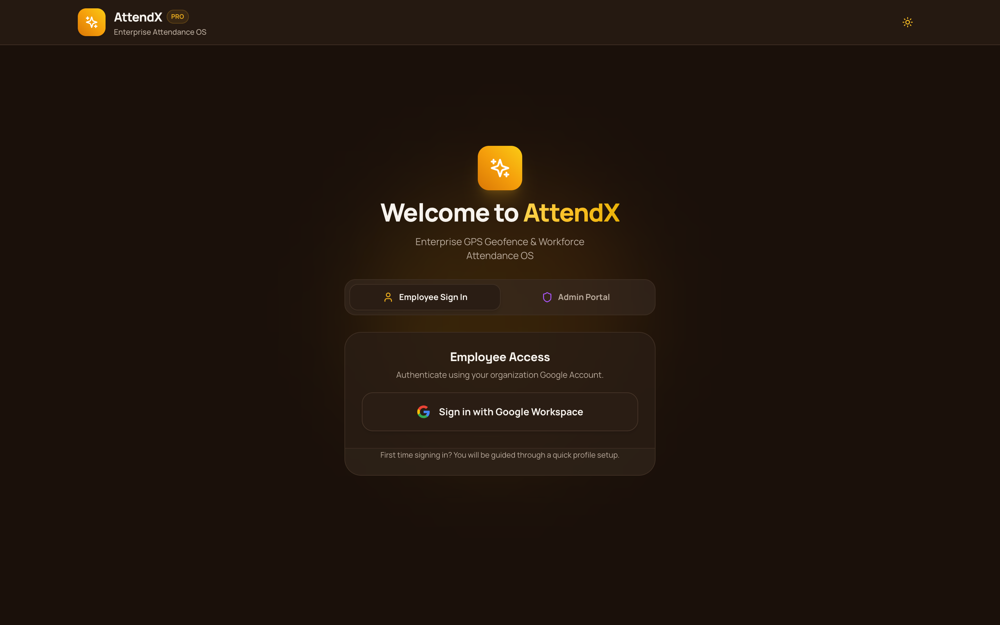

---

## 2. Admin Portal Login Page
**Route:** `http://localhost:5173/login`  
**Description:** Secure email and password login interface for workspace administrators.

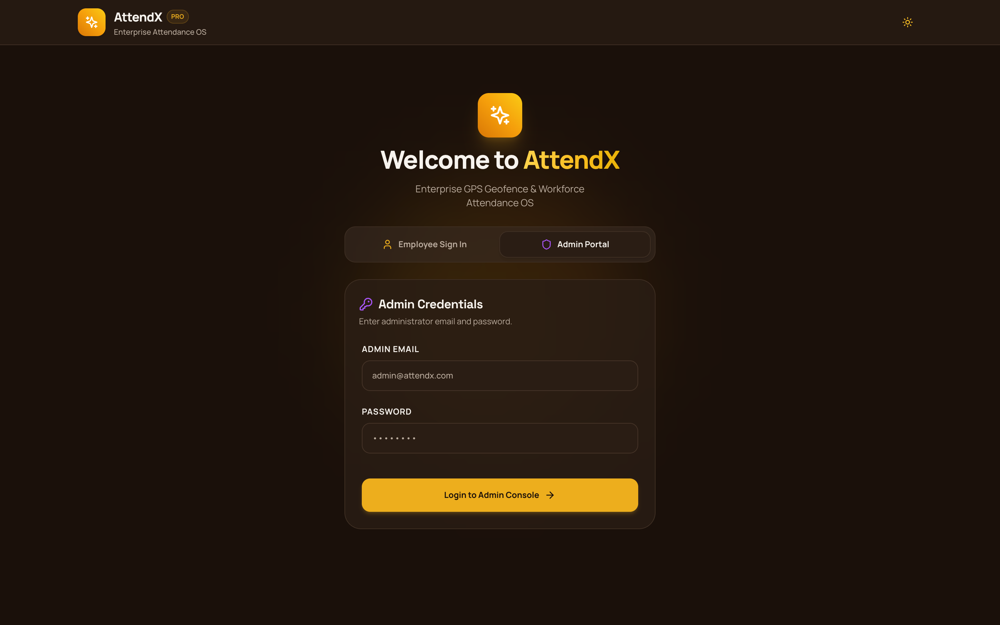

---

## 3. Google Account Picker
**Route:** `http://localhost:5173/google-picker`  
**Description:** Development Google OAuth selector allowing instant account testing across approved, pending, and new joiner profiles.

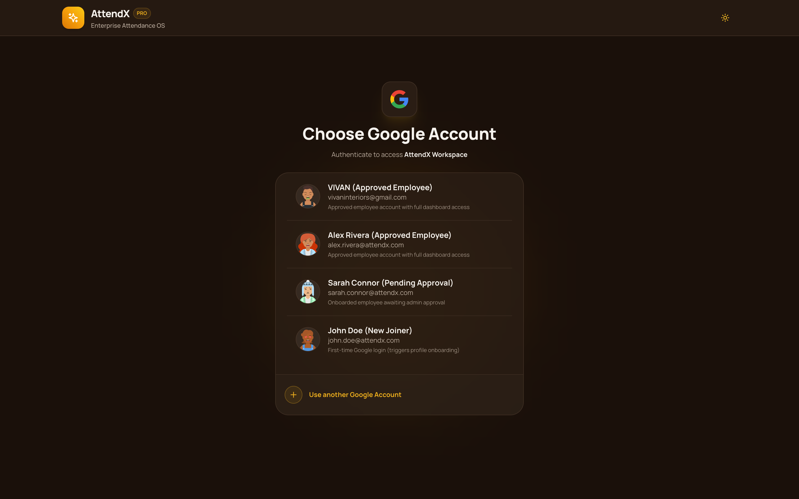

---

## 4. Employee Dashboard
**Route:** `http://localhost:5173/dashboard`  
**Description:** Real-time Chrono Telemetry terminal with live digital clock, GPS geofence validation button, office shift rules, and recent shift logs.

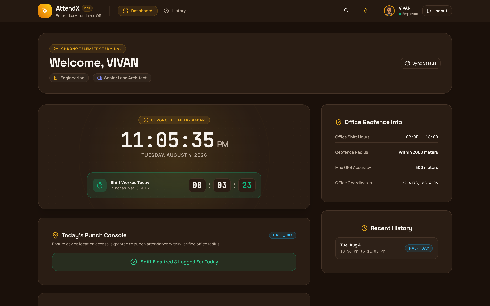

---

## 5. Attendance History Log
**Route:** `http://localhost:5173/history`  
**Description:** Comprehensive workforce audit ledger featuring keyword search, status filters, date range presets, CSV export, and modal late justifications.

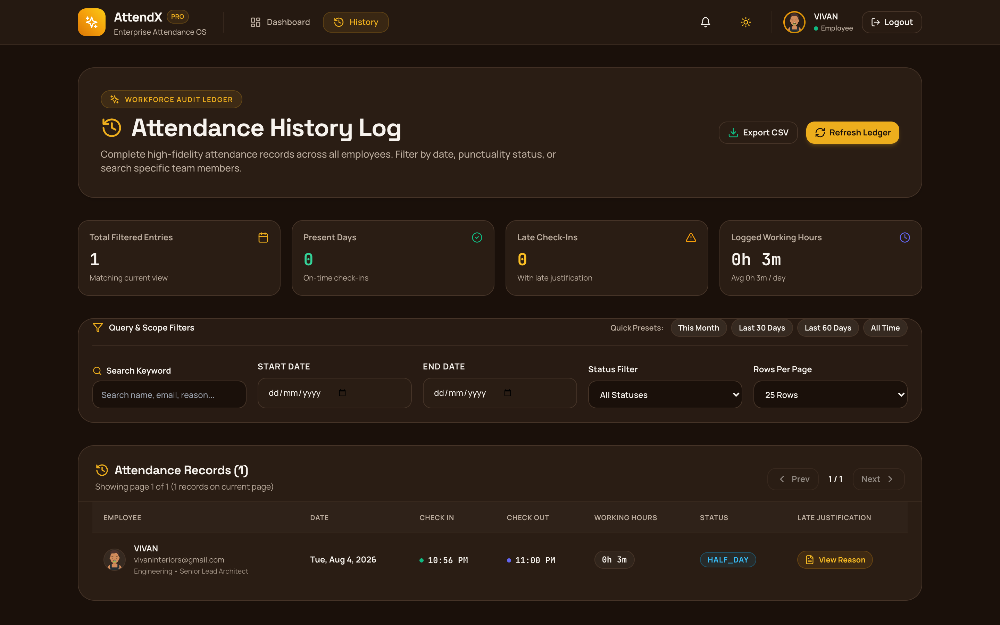

---

## 6. Profile Onboarding Page
**Route:** `http://localhost:5173/onboarding`  
**Description:** First-time employee profile setup form collecting organization department, designation, phone number, and age.

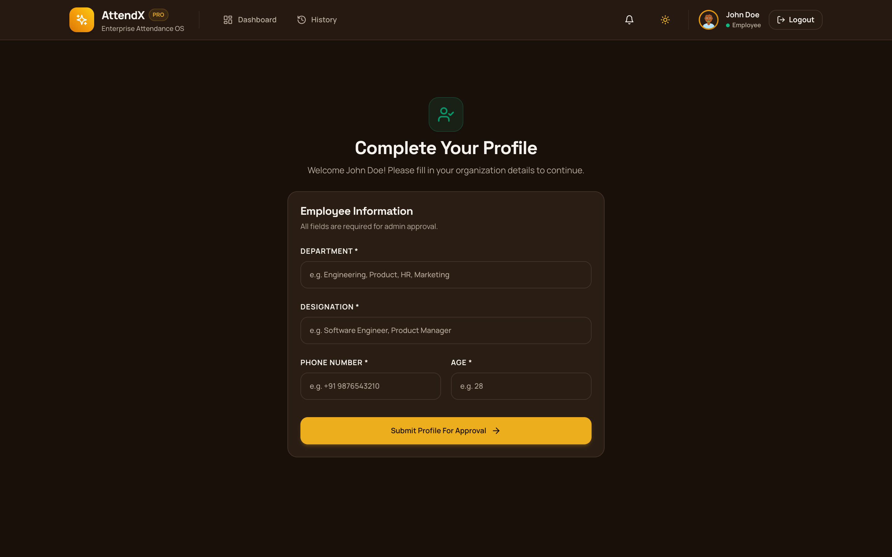

---

## 7. Pending Approval Page
**Route:** `http://localhost:5173/pending-approval`  
**Description:** Real-time status polling view displayed to newly registered employees awaiting administrator approval.

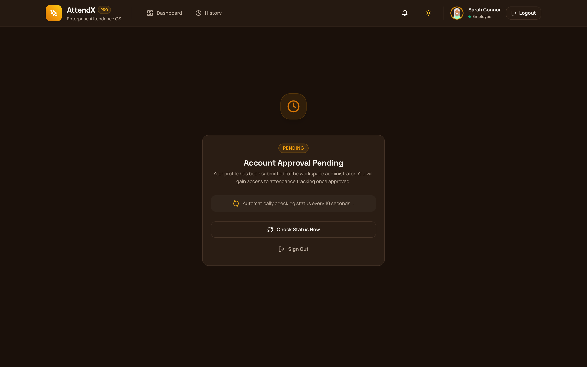

---

## 8. Admin Dashboard - Pending Approvals
**Route:** `http://localhost:5173/dashboard` (Admin View)  
**Description:** Administrator control queue to review, approve, or reject incoming employee registrations.

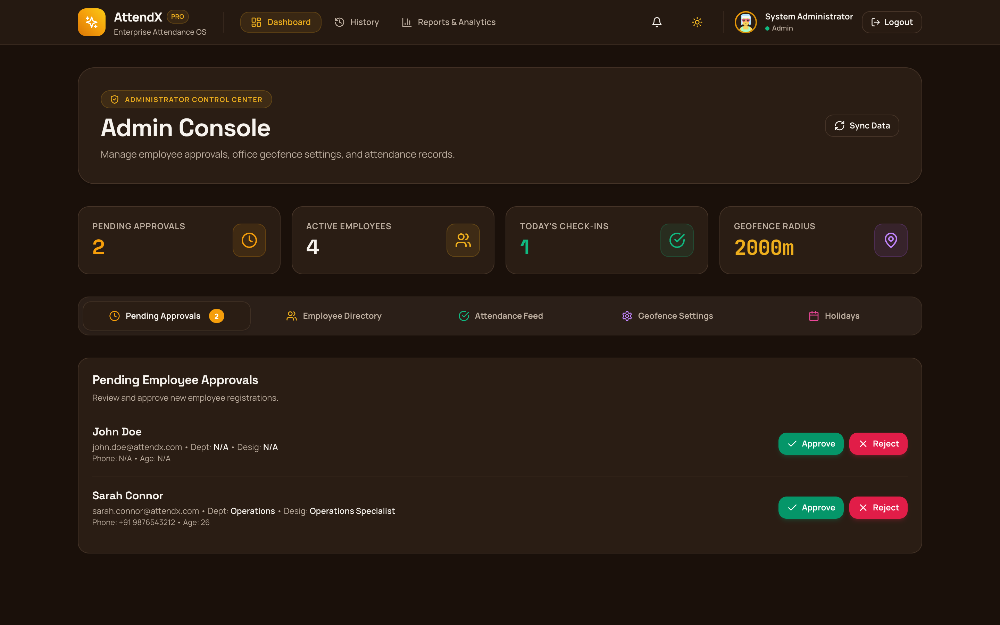

---

## 9. Admin Dashboard - Employee Directory
**Route:** `http://localhost:5173/dashboard` (Admin View -> Directory Tab)  
**Description:** Complete searchable roster of all approved and registered employees with role and status badges.

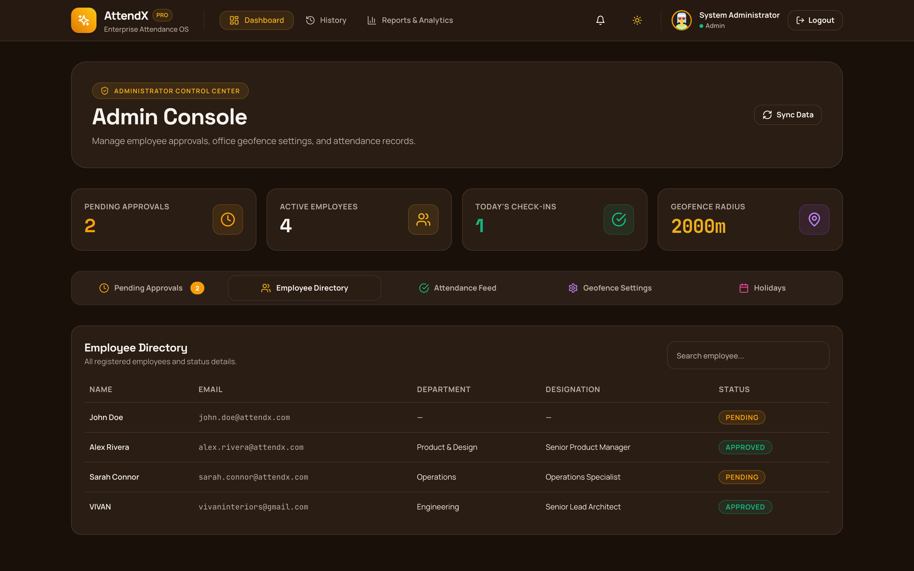

---

## 10. Admin Dashboard - Attendance Feed
**Route:** `http://localhost:5173/dashboard` (Admin View -> Attendance Feed Tab)  
**Description:** Live organization-wide check-in and check-out activity feed for the current date.

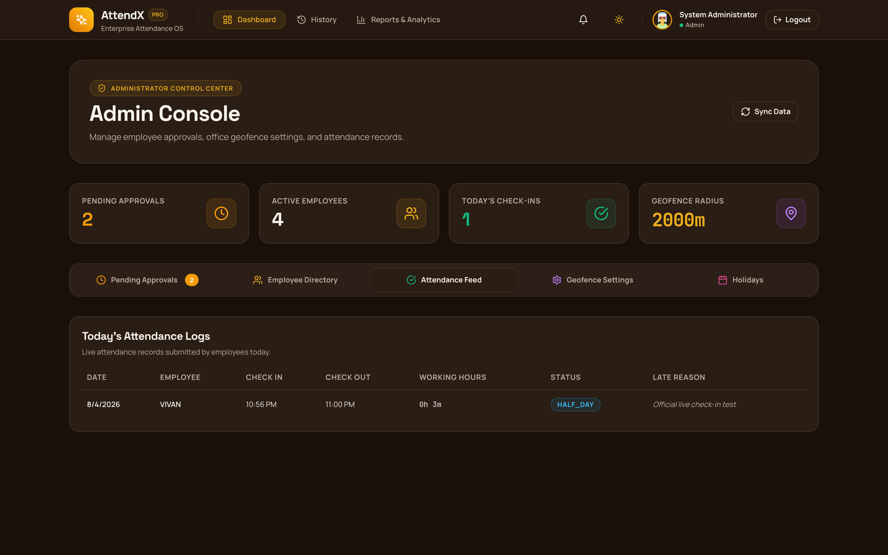

---

## 11. Admin Dashboard - Geofence Settings
**Route:** `http://localhost:5173/dashboard` (Admin View -> Geofence Settings Tab)  
**Description:** Configuration panel for office latitude/longitude, allowed geofence radius, maximum GPS accuracy threshold, and shift timings.

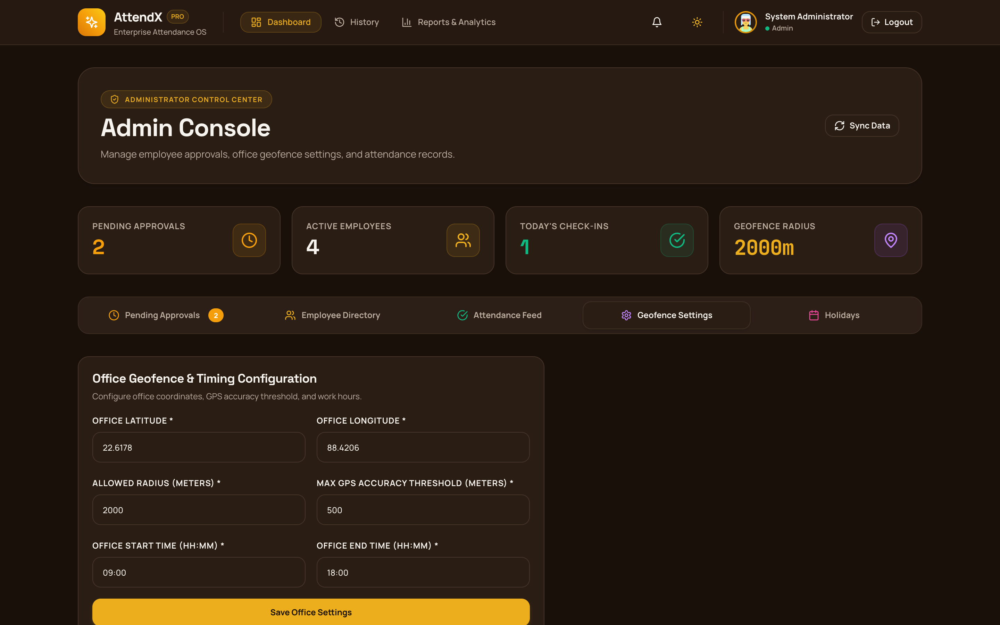

---

## 12. Admin Dashboard - Office Holidays
**Route:** `http://localhost:5173/dashboard` (Admin View -> Holidays Tab)  
**Description:** Official calendar holiday management interface to suppress auto-absent tracking on non-working days.

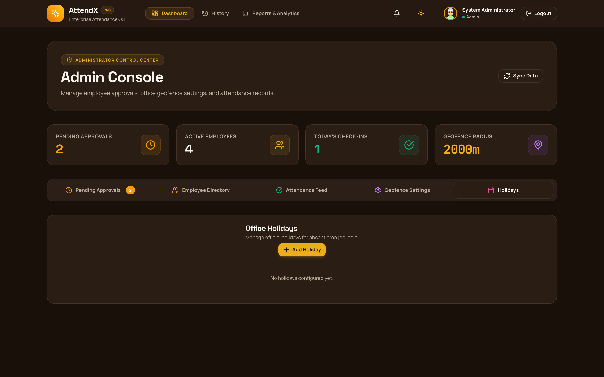

---

## 13. Reports & Analytics
**Route:** `http://localhost:5173/reports`  
**Description:** High-level executive reports, monthly attendance breakdown, punctuality metrics, and data export suite.

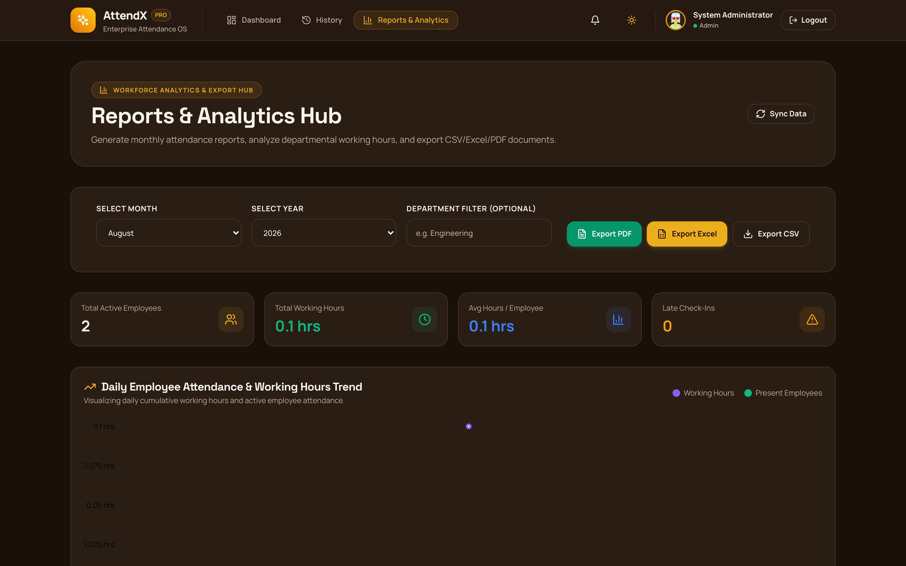
